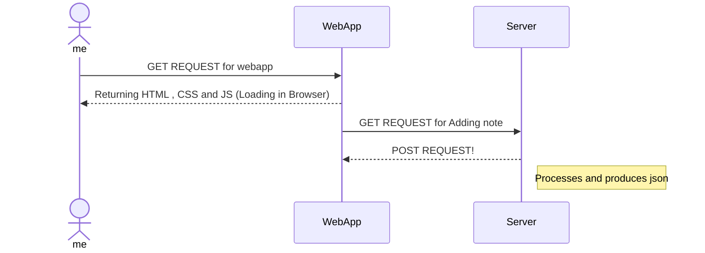

```mermaid

sequenceDiagram
actor me
me->>WebApp : GET REQUEST for webapp 
WebApp-->>me : Returning HTML , CSS and JS (Loading in Browser) 
WebApp->>Server: GET REQUEST for Adding note
Server-->>WebApp: POST REQUEST!
Note right of Server: Processes and produces json


```